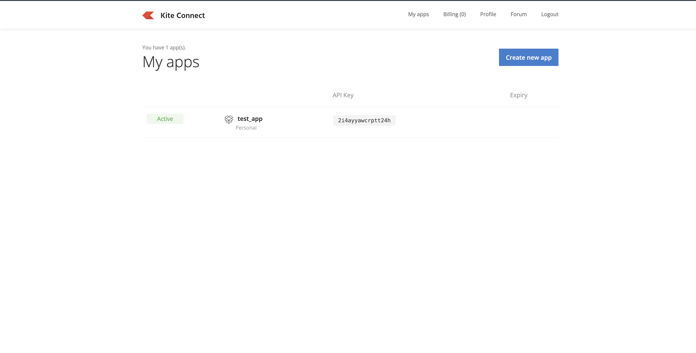

# Zerodha Adapter Documentation

This document explains how to connect **Zerodha** with **Blitz** using Zerodha’s Kite Connect APIs.

---

## Prerequisites

Before you begin, ensure that:

- You have an active Zerodha trading account
- Kite Connect API access is enabled for your account

---

## Step 1: Create a Zerodha Developer Account

1. Visit the Zerodha developer portal:  [Zerodha Developer Portal](https://developers.kite.trade/signup)


2. Sign up or log in to create the account.

3. You will redirected to the App creation page of zerodha.


4. Click on the Create new App button and choose Personal and fill the mandatory detials 


---

## Step 2: Get API Credentials

After creating the app, Zerodha will provide:

- **API Key**
- **API Secret**


> ⚠️ Keep these credentials secure. Do not expose them in public.

---

## Step 3: Generate Zerodha Login URL

Using the **API Key** and **API Secret**, generate a Zerodha login URL.
The login URL looks like `https://kite.zerodha.com/connect/login?v=3&api_key=2i8ayyawr7dptt24h`

- Share this login URL with the client
- The client must log in using their Zerodha credentials

---

## Step 4: Receive Request Token

1. After successful login, Zerodha redirects the user to the configured callback URL
2. The redirect URL contains a **request_token** as a query parameter
3. Copy the `request_token`

> ⚠️ The request token is short-lived and must be used immediately.

---

## Step 5: Generate Access Token

Using the following details:

- API Key
- API Secret
- Request Token
- Zerodha User ID

Generate the **Access Token**.

Once the access token is generated, the Zerodha account is successfully connected to Blitz.

---

## Authentication Flow Summary

1. Create Zerodha developer account  
2. Create app → get API Key & API Secret  
3. Generate login URL  
4. User logs in to Zerodha  
5. Receive request token  
6. Exchange request token for access token  
7. Zerodha connected to Blitz ✅  

---

# Blitz to Zerodha Conversion

Blitz request is published to the redis channel

## Place Order

**Blitz Request**


```json
{
  "action": "PLACE_ORDER",
  "TpomsName": "Zerodha",
  "UserID": "ABC123",
  "Data": {
      "Account":"Test123",
      "ExchangeClientID": "CLIENT_01",
      "ExchangeSegment": "NSE",
      "ExchangeInstrumentID": 1234,
      "ProductType": "MIS",
      "OrderType": "LIMIT",
      "OrderSide": "BUY",
      "TimeInForce": "DAY",
      "DisclosedQuantity": "10",
      "OrderQuantity": "100",
      "LimitPrice": 11.25,
      "StopPrice": 11.00,
      "BlitzAppOrderID": 4576347291,
      "AlgoID": "MOMENTUM_V1",
      "AlgoCategory": "INTRADAY",
      "UserExcahngeProperty_KeyInfo2": "ADDITIONAL_INFO",
      "UserLoginName":"harshit",
      "IsFictiveorder": "False"
    }
}
```

The request is then processed with the blitz_to_zerodha function which convert it to the zerodha payload 

**Zerodha Payload** -> Place Order

```json 
{
  "tradingsymbol": "IDEA",
  "exchange": "NSE",
  "transaction_type": "BUY",
  "order_type": "LIMIT",
  "quantity": 100,
  "product": "MIS",
  "price": 11.25,
  "trigger_price": 11.00,
  "disclosed_quantity": 10,
  "validity": "DAY"
}
```

After calling the zerodha API with the payload zerodha send the response in the below format

**Zerodha Websocket Raw Response (Order status is Open)**

```json
{
  "account_id": "RGZ539",
  "unfilled_quantity": 0,
  "checksum": "",
  "placed_by": "RGZ539",
  "order_id": "260108152046774",
  "exchange_order_id": "1100000084582744",
  "parent_order_id": null,
  "status": "OPEN",
  "status_message": null,
  "status_message_raw": null,
  "order_timestamp": "2026-01-08 15:23:46",
  "exchange_update_timestamp": "2026-01-08 15:23:46",
  "exchange_timestamp": "2026-01-08 15:23:46",
  "variety": "regular",
  "exchange": "NSE",
  "tradingsymbol": "IDEA",
  "instrument_token": 3677697,
  "order_type": "LIMIT",
  "transaction_type": "BUY",
  "validity": "DAY",
  "product": "MIS",
  "quantity": 100,
  "disclosed_quantity": 10,
  "price": 11.25,
  "trigger_price": 11.00,
  "average_price": 0,
  "filled_quantity": 0,
  "pending_quantity": 1,
  "cancelled_quantity": 0,
  "market_protection": 0,
  "meta": {},
  "tag": null,
  "guid": "1767866026-514556-RGZ539-ADMINAPI"
}
```


# Zerodha to Blitz Conversion
The response is then processed and then converted to blitz format 

**Blitz Response**

```json 
{
  "message_type": "ORDER_UPDATE",
  "broker": "Zerodha",
  "data": {
    "Id": 0,
    "EntityId": "",
    "InstrumentId": 3677697,
    "ExchangeSegment": "NSE",
    "InstrumentName": "IDEA",
    "BlitzOrderId": "BOID_11",
    "ExchangeOrderId": "1100000084582744",
    "ExecutionId": 0,
    "OrderType": "LIMIT",
    "OrderSide": "BUY",
    "OrderStatus": "NEW",
    "OrderQuantity": 1,
    "OrderPrice": 11.25,
    "OrderStopPrice": 0.0,
    "OrderTriggerPrice": 0.0,
    "LastTradedQuantity": 0,
    "LastTradedPrice": 0.0,
    "LeavesQuantity": 1,
    "TIF": "DAY",
    "OrderDisclosedQuantity": 0,
    "ExchangeTransactTime": "2026-01-08 15:23:46",
    "AverageTradedPrice": 0.0,
    "IsOrderCompleted": false,
    "UserText": "",
    "ExecutionType": "",
    "CorrelationOrderId": 0
  }
}
```

## Zerodha to Blitz Order 

| Zerodha Field | Zerodha Key | Blitz Field | Blitz Key | Example Value | Notes |
|---------------|-------------|-------------|-----------|---------------|-------|
| Order ID | `order_id` | Blitz Order ID | `BlitzOrderId` | `260108152046774` → `BOID_11` | Blitz-generated or mapped |
| Exchange Order ID | `exchange_order_id` | Exchange Order ID | `ExchangeOrderId` | `1100000084582744` | Direct mapping |
| Instrument Token | `instrument_token` | Instrument ID | `InstrumentId` | `3677697` | Direct mapping |
| Trading Symbol | `tradingsymbol` | Instrument Name | `InstrumentName` | `IDEA` | Direct mapping |
| Exchange | `exchange` | Exchange Segment | `ExchangeSegment` | `NSE` | Direct mapping |
| Transaction Type | `transaction_type` | Order Side | `OrderSide` | `BUY` | BUY / SELL |
| Order Type | `order_type` | Order Type | `OrderType` | `LIMIT` | Direct mapping |
| Order Status | `status` | Order Status | `OrderStatus` | `OPEN` → `NEW` | Status mapping applied |
| Quantity | `quantity` | Order Quantity | `OrderQuantity` | `1` | Direct mapping |
| Price | `price` | Order Price | `OrderPrice` | `11.35` | Direct mapping |
| Trigger Price | `trigger_price` | Order Trigger Price | `OrderTriggerPrice` | `0` | SL orders |
| Average Price | `average_price` | Average Traded Price | `AverageTradedPrice` | `0.0` | Default when no trade |
| Filled Quantity | `filled_quantity` | Last Traded Quantity | `LastTradedQuantity` | `0` | Updated on trade |
| Pending Quantity | `pending_quantity` | Leaves Quantity | `LeavesQuantity` | `1` | Remaining qty |
| Disclosed Quantity | `disclosed_quantity` | Order Disclosed Quantity | `OrderDisclosedQuantity` | `0` | Usually zero |
| Validity | `validity` | Time In Force | `TIF` | `DAY` | DAY / IOC |
| Exchange Timestamp | `exchange_timestamp` | Exchange Transact Time | `ExchangeTransactTime` | `2026-01-08 15:23:46` | Exchange time |
| Completion Flag | derived | Is Order Completed | `IsOrderCompleted` | `false` | Derived from status |

---

## Zerodha → Blitz Status Mapping

| Zerodha Status | Blitz Status | IsOrderCompleted |
|---------------|--------------|------------------|
| `OPEN` | `NEW` | `false` |
| `COMPLETE` | `FILLED` | `true` |
| `CANCELLED` | `CANCELLED` | `true` |
| `REJECTED` | `REJECTED` | `true` |

## Modify Order
**Blitz Request**

```json
{
  "action": "MODIFY_ORDER",
  "UserID": "ABC123",
  "data": {
    "Account": "",
    "ExchangeClientID": "CLIENT_01",
    "ExchangeSegment": "NSE",
    "ExchangeInstrumentID": 1234,
    "ExcahngeInstrumnetName" : "IDEA",
    "ModifiedProductType": "NRML",
    "ModifiedOrdertype": "SL",
    "ModifiedTimeInForce": "IOC",
    "ModifiedDisclosedQuantity": 10,
    "ModifiedOrderQuantity": 150,
    "ModifiedLimitPrice": 11.15,
    "ModifiedStopPrice": 11.10,
    "LeavesQuantity": 50,
    "CumulativeQuantity": 100,
    "LastOrderModifiedTime": "2026-01-08 15:23:46",
    "BlitzAooOrderID": 1234567891,
    "ExchangeOrderID": "EXCH_ORD_987654",
    "UserLoginName": "harshit"
  }
}
```

**Zerodha Response**
```json
{
  "account_id": "RGZ539",
  "unfilled_quantity": 0,
  "checksum": "",
  "placed_by": "RGZ539",
  "order_id": "260108152046774",
  "exchange_order_id": "1100000084582744",
  "parent_order_id": null,
  "status": "UPDATE",
  "status_message": null,
  "status_message_raw": null,
  "order_timestamp": "2026-01-08 15:23:46",
  "exchange_update_timestamp": "2026-01-08 15:23:46",
  "exchange_timestamp": "2026-01-08 15:23:46",
  "variety": "regular",
  "exchange": "NSE",
  "tradingsymbol": "IDEA",
  "instrument_token": 3677697,
  "order_type": "LIMIT",
  "transaction_type": "BUY",
  "validity": "DAY",
  "product": "MIS",
  "quantity": 1,
  "disclosed_quantity": 0,
  "price": 11.25,
  "trigger_price": 0,
  "average_price": 0,
  "filled_quantity": 0,
  "pending_quantity": 1,
  "cancelled_quantity": 0,
  "market_protection": 0,
  "meta": {},
  "tag": null,
  "guid": "205871XvWfpJkFLquRq"
}
```

```json
{
  "account_id": "RGZ539",
  "unfilled_quantity": 0,
  "checksum": "",
  "placed_by": "RGZ539",
  "order_id": "260108152046774",
  "exchange_order_id": "1100000084582744",
  "parent_order_id": null,
  "status": "OPEN",
  "status_message": null,
  "status_message_raw": null,
  "order_timestamp": "2026-01-08 15:23:46",
  "exchange_update_timestamp": "2026-01-08 15:23:46",
  "exchange_timestamp": "2026-01-08 15:23:46",
  "variety": "regular",
  "exchange": "NSE",
  "tradingsymbol": "IDEA",
  "instrument_token": 3677697,
  "order_type": "LIMIT",
  "transaction_type": "BUY",
  "validity": "DAY",
  "product": "MIS",
  "quantity": 1,
  "disclosed_quantity": 0,
  "price": 11.35,
  "trigger_price": 0,
  "average_price": 0,
  "filled_quantity": 0,
  "pending_quantity": 1,
  "cancelled_quantity": 0,
  "market_protection": 0,
  "meta": {},
  "tag": null,
  "guid": "1767866026-514556-RGZ539-ADMINAPI"
}
```

**Blitz Response**
```json
{
  "message_type": "ORDER_UPDATE",
  "broker": "Zerodha",
  "data": {
    "Id": 0,
    "EntityId": "",
    "InstrumentId": 3677697,
    "ExchangeSegment": "NSE",
    "InstrumentName": "IDEA",
    "BlitzOrderId": "BOID_07",
    "ExchangeOrderId": "1100000084582744",
    "ExecutionId": 0,
    "OrderType": "LIMIT",
    "OrderSide": "BUY",
    "OrderStatus": "UPDATE",
    "OrderQuantity": 1,
    "OrderPrice": 11.25,
    "OrderStopPrice": 0.0,
    "OrderTriggerPrice": 0.0,
    "LastTradedQuantity": 0,
    "LastTradedPrice": 0.0,
    "LeavesQuantity": 1,
    "TIF": "DAY",
    "OrderDisclosedQuantity": 0,
    "ExchangeTransactTime": "2026-01-08 15:23:46",
    "AverageTradedPrice": 0.0,
    "IsOrderCompleted": false,
    "UserText": "",
    "ExecutionType": "",
    "CorrelationOrderId": 0
  }
}
```


```json
{
  "message_type": "ORDER_UPDATE",
  "broker": "Zerodha",
  "data": {
    "Id": 0,
    "EntityId": "",
    "InstrumentId": 3677697,
    "ExchangeSegment": "NSE",
    "InstrumentName": "IDEA",
    "BlitzOrderId": "BOID_07",
    "ExchangeOrderId": "1100000084582744",
    "ExecutionId": 0,
    "OrderType": "LIMIT",
    "OrderSide": "BUY",
    "OrderStatus": "NEW",
    "OrderQuantity": 1,
    "OrderPrice": 11.35,
    "OrderStopPrice": 0.0,
    "OrderTriggerPrice": 0.0,
    "LastTradedQuantity": 0,
    "LastTradedPrice": 0.0,
    "LeavesQuantity": 1,
    "TIF": "DAY",
    "OrderDisclosedQuantity": 0,
    "ExchangeTransactTime": "2026-01-08 15:23:46",
    "AverageTradedPrice": 0.0,
    "IsOrderCompleted": false,
    "UserText": "",
    "ExecutionType": "",
    "CorrelationOrderId": 0
  }
}
```

## Cancel Order

**Blitz Request**

```json
{
  "action": "CANCEL_ORDER",
  "data": {
    "BlitzOrderID": "BOID_07"
  }
}
```

**Zerodha Response**
```json
{
  "account_id": "RGZ539",
  "unfilled_quantity": 0,
  "checksum": "",
  "placed_by": "RGZ539",
  "order_id": "260108152046774",
  "exchange_order_id": "1100000084582744",
  "parent_order_id": null,
  "status": "CANCELLED",
  "status_message": null,
  "status_message_raw": null,
  "order_timestamp": "2026-01-08 15:23:57",
  "exchange_update_timestamp": "2026-01-08 15:23:57",
  "exchange_timestamp": "2026-01-08 15:23:57",
  "variety": "regular",
  "exchange": "NSE",
  "tradingsymbol": "IDEA",
  "instrument_token": 3677697,
  "order_type": "LIMIT",
  "transaction_type": "BUY",
  "validity": "DAY",
  "product": "MIS",
  "quantity": 1,
  "disclosed_quantity": 0,
  "price": 11.35,
  "trigger_price": 0,
  "average_price": 0,
  "filled_quantity": 0,
  "pending_quantity": 1,
  "cancelled_quantity": 1,
  "market_protection": 0,
  "meta": {},
  "tag": null,
  "guid": "1767866026-514556-RGZ539-ADMINAPI"
}
```

```json
{
  "account_id": "RGZ539",
  "unfilled_quantity": 0,
  "checksum": "",
  "placed_by": "RGZ539",
  "order_id": "260108152046774",
  "exchange_order_id": "1100000084582744",
  "parent_order_id": null,
  "status": "CANCELLED",
  "status_message": null,
  "status_message_raw": null,
  "order_timestamp": "2026-01-08 15:23:57",
  "exchange_update_timestamp": "2026-01-08 15:23:57",
  "exchange_timestamp": "2026-01-08 15:23:57",
  "variety": "regular",
  "exchange": "NSE",
  "tradingsymbol": "IDEA",
  "instrument_token": 3677697,
  "order_type": "LIMIT",
  "transaction_type": "BUY",
  "validity": "DAY",
  "product": "MIS",
  "quantity": 1,
  "disclosed_quantity": 0,
  "price": 11.35,
  "trigger_price": 0,
  "average_price": 0,
  "filled_quantity": 0,
  "pending_quantity": 0,
  "cancelled_quantity": 1,
  "market_protection": 0,
  "meta": {},
  "tag": null,
  "guid": "1767866037-597794-RGZ539-ADMINAPI"
}
```

**Blitz Response**
```json
{
  "message_type": "ORDER_UPDATE",
  "broker": "Zerodha",
  "data": {
    "Id": 0,
    "EntityId": "",
    "InstrumentId": 3677697,
    "ExchangeSegment": "NSE",
    "InstrumentName": "IDEA",
    "BlitzOrderId": "BOID_07",
    "ExchangeOrderId": "1100000084582744",
    "ExecutionId": 0,
    "OrderType": "LIMIT",
    "OrderSide": "BUY",
    "OrderStatus": "CANCELLED",
    "OrderQuantity": 1,
    "OrderPrice": 11.35,
    "OrderStopPrice": 0.0,
    "OrderTriggerPrice": 0.0,
    "LastTradedQuantity": 0,
    "LastTradedPrice": 0.0,
    "LeavesQuantity": 1,
    "TIF": "DAY",
    "OrderDisclosedQuantity": 0,
    "ExchangeTransactTime": "2026-01-08 15:23:57",
    "AverageTradedPrice": 0.0,
    "IsOrderCompleted": true,
    "UserText": "",
    "ExecutionType": "",
    "CorrelationOrderId": 0
  }
}
```

```json
{
  "message_type": "ORDER_UPDATE",
  "broker": "Zerodha",
  "data": {
    "Id": 0,
    "EntityId": "",
    "InstrumentId": 3677697,
    "ExchangeSegment": "NSE",
    "InstrumentName": "IDEA",
    "BlitzOrderId": "BOID_07",
    "ExchangeOrderId": "1100000084582744",
    "ExecutionId": 0,
    "OrderType": "LIMIT",
    "OrderSide": "BUY",
    "OrderStatus": "CANCELLED",
    "OrderQuantity": 1,
    "OrderPrice": 11.35,
    "OrderStopPrice": 0.0,
    "OrderTriggerPrice": 0.0,
    "LastTradedQuantity": 0,
    "LastTradedPrice": 0.0,
    "LeavesQuantity": 0,
    "TIF": "DAY",
    "OrderDisclosedQuantity": 0,
    "ExchangeTransactTime": "2026-01-08 15:23:57",
    "AverageTradedPrice": 0.0,
    "IsOrderCompleted": true,
    "UserText": "",
    "ExecutionType": "",
    "CorrelationOrderId": 0
  }
}
```